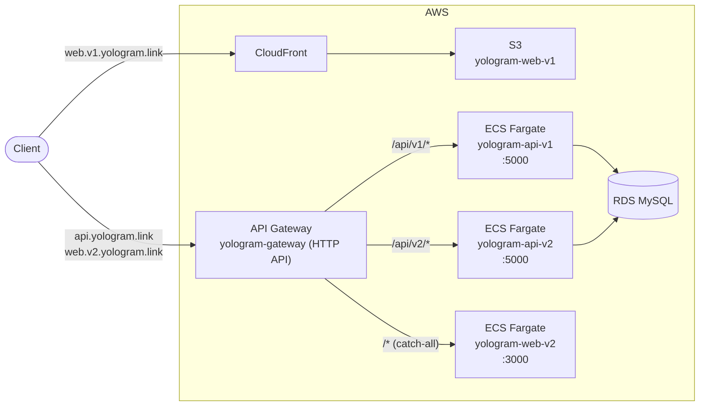

# yologram-infra

yologram AWS 인프라 관리 (Terraform).

## 서비스

- [https://github.com/yologger/yologram](https://github.com/yologger/yologram)
- API Gateway: https://api.yologram.link
- web-v1 (CloudFront): https://web.v1.yologram.link
- web-v2 (ECS): https://web.v2.yologram.link

## 아키텍처



> API Gateway → ECS 연결은 VPC Link + Cloud Map(service discovery) 경유.
> ElastiCache(Valkey)와 OpenSearch는 프로비저닝되어 있으나 앱 연결은 별도 (다이어그램 생략).

## 구조

```
aws/
  global/
    vpc/                    # VPC (vpc-prod, 10.0.0.0/16)
    ecs/                    # ECS 클러스터 (ecs-prod, Fargate SPOT) + Cloud Map + IAM
    api-gateway/            # HTTP API Gateway (yologram-gateway), VPC Link, Custom Domain
    database/               # RDS MySQL 8.0 (db.t4g.micro)
    elasticache/            # Valkey 8.0 (cache.t3.micro)
    opensearch/             # OpenSearch 2.19 (t3.small.search)
  services/
    yologram-api-v1/        # Spring Boot API (ECS Fargate SPOT)
    yologram-api-v2/        # FastAPI (ECS Fargate SPOT)
    yologram-web-v1/        # S3 + CloudFront (SPA)
    yologram-web-v2/        # Next.js (ECS Fargate SPOT)
  tools/
    n8n/                    # n8n 워크플로우 자동화 (Lightsail)
```
