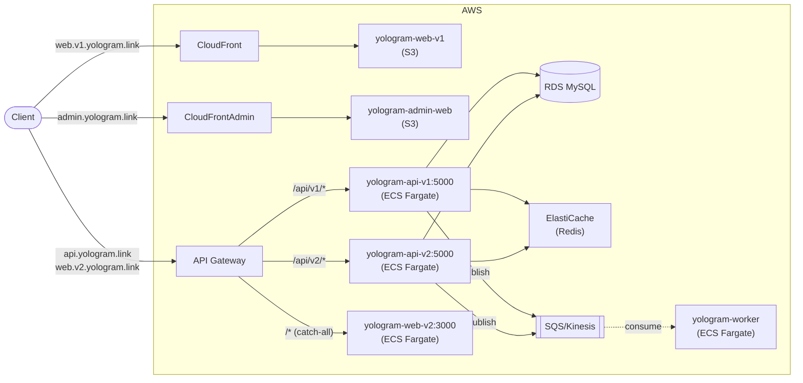

# yologram

모노레포 기반 프로젝트

- [https://web.v1.yologram.link/](https://web.v1.yologram.link/): React.js + Spring Boot MVC
- [https://web.v2.yologram.link/](https://web.v2.yologram.link/): Next.js + FastAPI

## 프로젝트 & 기술 스택

- `yologram-api-v1`: Spring Boot MVC + Kotlin ([기술 스택](yologram-api-v1/README.md))
- `yologram-api-v2`: FastAPI + Python ([기술 스택](yologram-api-v2/README.md))
    - 스터디 목적으로 api-v1을 Python 기반으로 구현
- `yologram-web-v1`: React + TypeScript ([기술 스택](yologram-web-v1/README.md))
- `yologram-web-v2`: Next.js + TypeScript ([기술 스택](yologram-web-v2/README.md))
    - 스터디 목적으로 web-v1을 Next.js 기반으로 구현
- `yologram-worker`: Spring Boot + Kotlin ([기술 스택](yologram-worker/README.md))
    - SQS 비동기 처리
    - Kinesis stream 처리
    - Cron Batch 실행
- `yologram-admin-web`: React + TypeScript 기반 ([기술 스택](yologram-admin-web/README.md))
    - 어드민 웹

## 인프라

- IaC: Terraform ([terraform/](terraform/README.md))
- ECS Fargate: api-v1(5000), api-v2(5000), web-v2(3000)
- API Gateway: api.yologram.link / web.v2.yologram.link → /api/v1/{proxy+}는 api-v1, /api/v2/{proxy+}는 api-v2, /{proxy+}는 web-v2
- web-v1: S3 + CloudFront (web.v1.yologram.link)
- admin-web: S3 + CloudFront (admin.yologram.link)
- worker: ECS Fargate (인바운드 없음)
- 캐시: ElastiCache Valkey (valkey-prod, cache.t4g.micro)
- 스트림: Kinesis + DynamoDB (checkpoint + shedlock)
    - api-v1·v2가 발행하고 worker가 Spring Cloud Stream Kinesis binder로 소비

## CI/CD

- GitHub Actions (디렉토리별 독립 트리거)
- ECR push 시 이미지 태그: {branch}-{commit SHA 8자리}
- 배포 결과 Discord 웹훅 알림

## Todos

해야 할 작업은 [/docs/todos.md](/docs/todos.md) 참조

## Dones

완료 된 작업은 [/docs/done.md](/docs/done.md) 참조