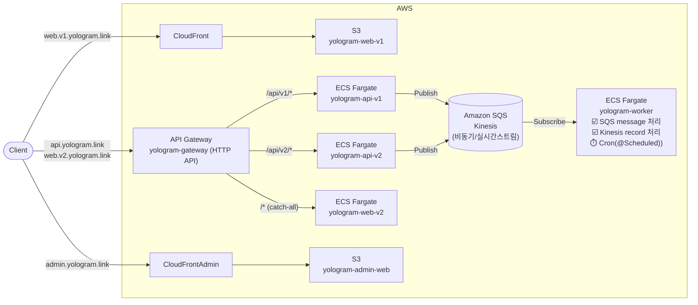

# yologram-infra

yologram AWS 인프라 관리 (Terraform).

## 서비스

- [https://github.com/yologger/yologram](https://github.com/yologger/yologram)
- API Gateway: https://api.yologram.link
- web-v1 (CloudFront): https://web.v1.yologram.link
- web-v2 (ECS): https://web.v2.yologram.link
- admin-web (CloudFront): https://admin.yologram.link

## 아키텍처



> API Gateway → ECS 연결은 VPC Link + Cloud Map(service discovery) 경유.
> ElastiCache(Valkey)와 OpenSearch는 프로비저닝되어 있으나 앱 연결은 별도 (다이어그램 생략).

## 구조

```
aws/
  global/
    vpc/                    # VPC (vpc-prod, 10.0.0.0/16)
    ecs/                    # ECS 클러스터 (ecs-prod, Fargate SPOT) + Cloud Map + IAM
    api-gateway/            # HTTP API Gateway (yologram-gateway), VPC Link, Custom Domain
    database/               # RDS MySQL 8.0 (db.t4g.micro)
    elasticache/            # Valkey 8.0 (cache.t3.micro)
    opensearch/             # OpenSearch 2.19 (t3.small.search)
  services/
    yologram-api-v1/        # Spring Boot API (ECS Fargate SPOT)
    yologram-api-v2/        # FastAPI (ECS Fargate SPOT)
    yologram-web-v1/        # S3 + CloudFront (SPA)
    yologram-web-v2/        # Next.js (ECS Fargate SPOT)
    yologram-worker/        # Spring Boot 비동기 워커 (ECS Fargate SPOT, 인바운드 없음)
    yologram-admin-web/     # 어드민 웹, S3 + CloudFront (SPA)
  tools/
    n8n/                    # n8n 워크플로우 자동화 (Lightsail)
```

## 요금

월 예상 요금

| 리소스 | 프리티어 | 온디멘드 + RI | 비고 |
| --- | --- | --- | --- |
| VPC·서브넷 | 무료 | 무료 | 과금 없음 |
| Cloud Map | 무료 | 무료 | 과금 없음 |
| VPC Link | 무료 | 무료 | 과금 없음 |
| Data Transfer | $0.23 | $0.23 | 아웃바운드 전송 |
| Route 53 | $1.01 | $1.01 | hosted zone + 쿼리 |
| API Gateway | ~$0 | ~$0 | 사용량 비례 |
| CloudFront | ~$0 | ~$0 | 사용량 비례 |
| VPC Public IPv4 주소 | $10.67 | $10.67 | 퍼블릭 IP 4개(Fargate 3 + RDS 1) |
| ECS Fargate SPOT | $9.21 | $9.21 | 태스크 3개, 0.25 vCPU / 0.5 GB |
| ElastiCache | $3.51 | $8.93 (RI) | Valkey, cache.t4g.micro |
| RDS MySQL | $0 | $13.50 (RI) | db.t4g.micro |
| OpenSearch | $0 | $40.88 (온디멘드) | t3.small.search, RI 불가 |
| Lightsail (n8n) | $0 (첫 3개월 무료) | $5 | 무료 종료 후 $5/월 |
| S3 | ~$0 | ~$0 | 사용량 비례 |
| SES | ~$0 | ~$0 | 사용량 비례 |
| ECR | $0.09 | $0.09 | 사용량 비례 |
| Google Workspace | $7.56 | $7.56 | Starter 플랜 |
| 합계($) | $32.28 | $97.08 | Google Workspace 포함 |
| 합계(₩) | 약 ₩48,000 | 약 ₩146,000 | ₩1,500/$ 기준 |


RI 요금

| 리소스 | 타입 | 온디멘드<br/>(시간당) | 온디멘드<br/>(월간) | 온디멘드<br/>(연간) | RI<br/>(시간당) | RI<br/>(월간) | RI<br/>(연간) |
| --- | --- | --- | --- | --- | --- | --- | --- |
| RDS MySQL | db.t4g.micro | $0.025 | $18.25 | $219 | $0.018 | $13.5 | $162.00 |
| ElastiCache (Valkey) | cache.t4g.micro | $0.0192 | $14.016 | $168.192 | $0.012237 | $8.93 | $107.20 |
| Opensearch | t3.small.search | $0.056 | $40.88 | $490.56 | - | - | - |

### 합계

(Google Workspace $7.56 포함, ₩1,500/$ 기준)

| 시나리오 | 월 | 연 |
| --- | --- | --- |
| 현재(프리티어) | 약 $32 (₩48,000) | 약 $387 (₩581,000) |
| 프리티어 만료 후(RI 적용) | 약 $97 (₩146,000) | 약 $1,165 (₩1,747,000) |
| 만료 후 + OpenSearch self-host($7) | 약 $63 (₩95,000) | 약 $758 (₩1,138,000) |

- 프리티어는 계정 생성 후 12개월 한정. 이후 만료 요금 적용
- 최대 절감 레버: OpenSearch 관리형($40.88) → Lightsail self-host($7)로 전환 시 만료 후 월 $34 절감