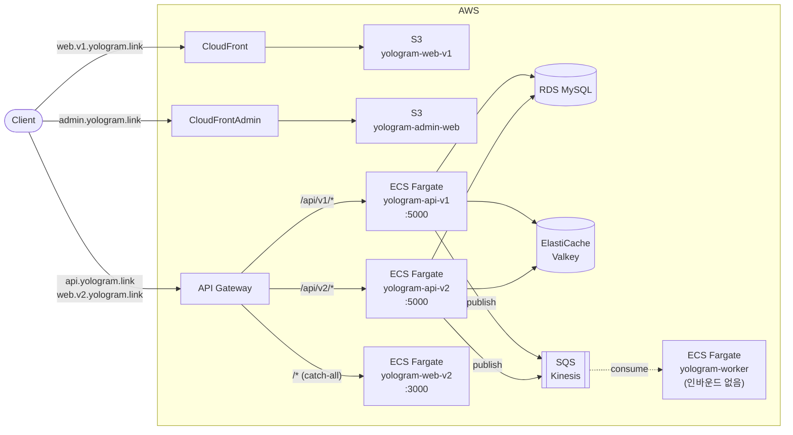

# yologram

모노레포 구성의 풀스택 프로젝트. 동일 로직을 다른 기술 스택으로 구현.

## 구조

- yologram-api-v1/: Spring Boot MVC (Kotlin)
- yologram-web-v1/: React
- yologram-api-v2/: FastAPI
- yologram-web-v2/: Next.js
- yologram-worker/: Spring Boot 비동기 워커 (Kotlin)
- yologram-admin-web/: 어드민 웹 (React, web-v1과 동일 스택)
- compose.yaml: 로컬 개발용 인프라 (Valkey 캐시 — DB는 공유 RDS라 미포함)
- .github/workflows/: GitHub Actions

## 인프라

- [https://github.com/yologger/yologram-infra](https://github.com/yologger/yologram-infra)
- IaC: Terraform (yologram-infra 레포에서 관리)
- ECS Fargate: api-v1(5000), api-v2(5000), web-v2(3000)
- API Gateway: api.yologram.link / web.v2.yologram.link → /api/v1/{proxy+}는 api-v1, /api/v2/{proxy+}는 api-v2, /{proxy+}는 web-v2
- web-v1: S3 + CloudFront (web.v1.yologram.link)
- admin-web: S3 + CloudFront (admin.yologram.link)
- worker: ECS Fargate (인바운드 없음)
- 캐시: ElastiCache Valkey (valkey-prod, cache.t4g.micro) — api-v1/v2 닉네임 캐시




## CI/CD

- GitHub Actions (디렉토리별 독립 트리거)
- ECR push 시 이미지 태그: {branch}-{commit SHA 8자리}
- 배포 결과 Discord 웹훅 알림

## ECS 컨테이너 접속

```bash
aws ecs execute-command \
  --cluster ecs-prod \
  --task <task-id> \
  --container yologram-api-v1 \
  --interactive \
  --command "/bin/sh" \
  --profile yologram \
  --region ap-northeast-2
```

## API Key
Gemini (1순위)
1. https://aistudio.google.com/apikey 접속 (구글 계정 로그인)
2. 약관 동의하면 기본 프로젝트가 자동 생성됨
3. "Create API key" 클릭 → 키 생성·복사 (무료 티어는 키 발급만으로 적용, 결제 설정 안 하면 자동으로 free tier)
4. SSM Parameter: `/yologram/service/yologram-worker_prod/yologram.llm.gemini.api-key`

Groq (2순위)
1. https://console.groq.com 가입 (이메일 또는 구글/깃허브 로그인)
2. https://console.groq.com/keys 에서 "Create API Key" 클릭
3. 키는 생성 직후 한 번만 표시되므로 그 자리에서 복사
4. SSM Parameter: `/yologram/service/yologram-worker_prod/yologram.llm.groq.api-key`