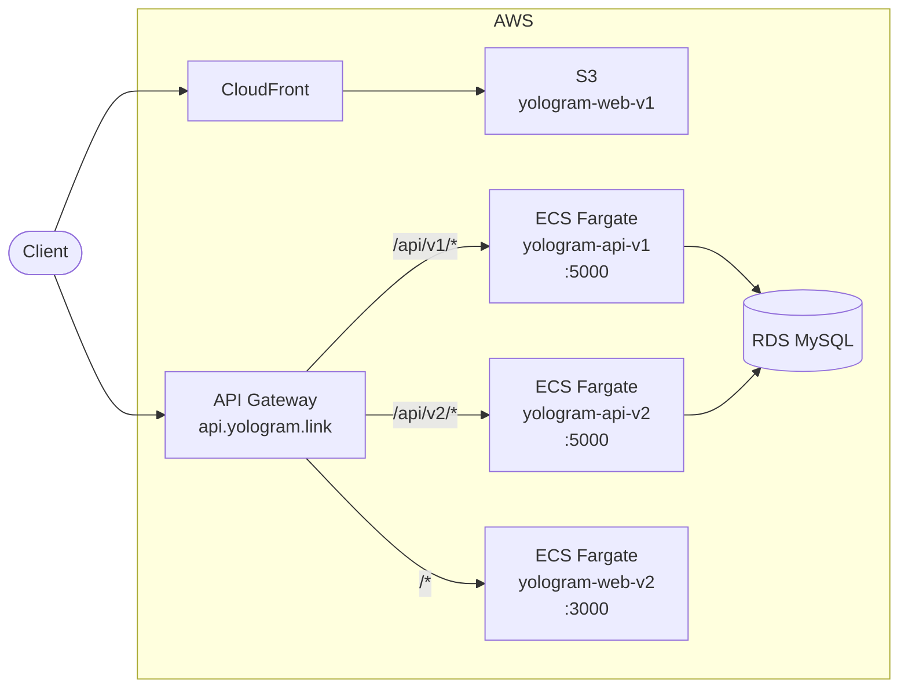

# yologram

모노레포 구성의 풀스택 프로젝트. 동일 로직을 다른 기술 스택으로 구현.

## 구조

- yologram-api-v1/: Spring Boot MVC (Kotlin)
- yologram-web-v1/: React
- yologram-api-v2/: FastAPI
- yologram-web-v2/: Next.js
- .github/workflows/: GitHub Actions

## 인프라

- [https://github.com/yologger/yologram-infra](https://github.com/yologger/yologram-infra)
- IaC: Terraform (yologger-infra 레포에서 관리)
- ECS Fargate: api-v1(5000), api-v2(5000), web-v2(3000)
- API Gateway: api.yologram.link → /api/v1/{proxy+}는 api-v1, /api/v2/{proxy+}는 api-v2, /{proxy+}는 web-v2
- web-v1: S3 + CloudFront



## CI/CD

- GitHub Actions (디렉토리별 독립 트리거)
- ECR push 시 이미지 태그: {branch}-{commit SHA 8자리}
- 배포 결과 Discord 웹훅 알림

## ECS 컨테이너 접속

```bash
aws ecs execute-command \
  --cluster ecs-prod \
  --task <task-id> \
  --container yologram-api-v1 \
  --interactive \
  --command "/bin/sh" \
  --profile yologram \
  --region ap-northeast-2
```
