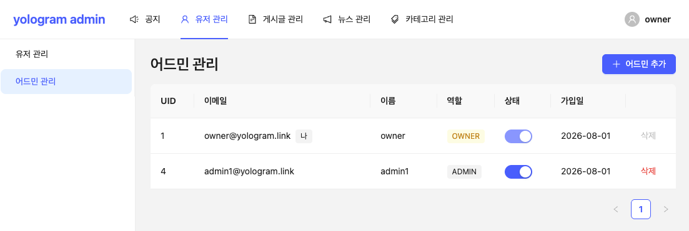
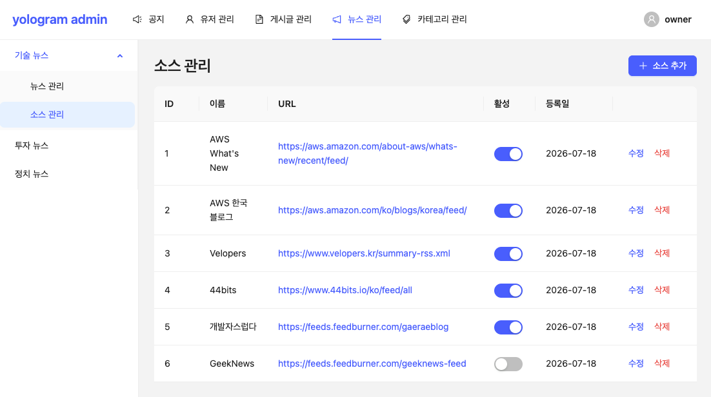
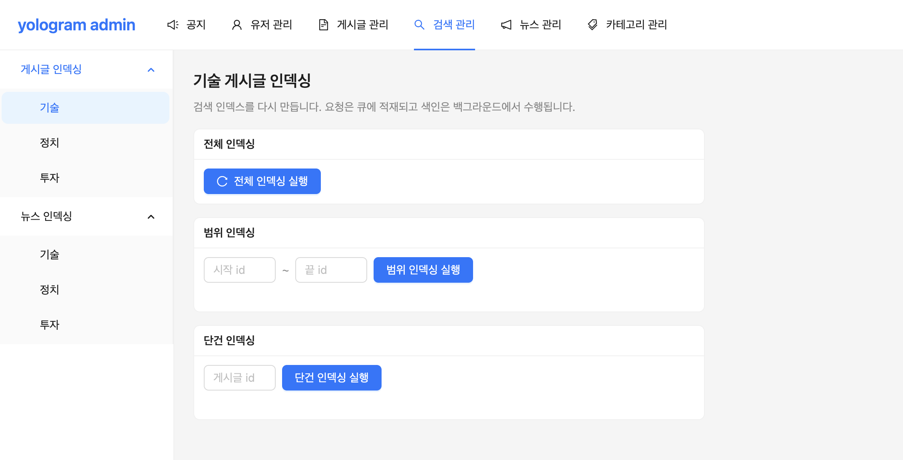

# yologram-admin-web

yologram 어드민 웹. 유저/게시글/뉴스/카테고리 관리 기능을 상단 바(최상위 분류) + 사이드바(하위 분류) 2단 내비게이션으로 제공한다.
어드민 전용 JWT 로그인·인증 가드가 적용되어 있으며, 현재 어드민 관리·뉴스 소스 관리·게시글 인덱싱이 실화면으로 동작한다 (나머지 메뉴는 준비 중).

## 화면 예시

어드민 관리 — 역할(OWNER/ADMIN)·상태 토글(OWNER 전용)·페이지네이션:



뉴스 관리 > 기술 뉴스 > 소스 관리 — RSS 소스 CRUD·활성 토글:



검색 관리 > 게시글 인덱싱 > 기술 — Opensearch Fullindexing, Range indexing:



## 기술 스택

- React 19 + React Router 7 (web-v1과 동일 구성)
- Vite + TypeScript
- Ant Design + CSS Modules (테마 컬러: 파란 계열 #1677ff)
- Jotai (상태 관리), axios + TanStack Query (API 통신)
- Vitest + Testing Library + MSW (테스트), ESLint + Prettier
- Yarn Berry (non-zero-install), Node 24
- API 대상: api-v1 (Spring)

## 주요 기능

- 어드민 로그인 (어드민 전용 JWT — 서비스 유저 토큰과 분리), AuthGate 토큰 복원, 전 메뉴 인증 보호(RequireAuth)
- 유저 관리 > 어드민 관리: 목록(서버사이드 페이지네이션)·추가·삭제, 역할 표시(OWNER gold), OWNER 전용 활성/비활성 토글
- 검색 관리 > 게시글 인덱싱: 전체(확인 모달)·범위(from~to)·단건(id) 발행. 202 응답이라 발행 여부만 알림(진행률 없음), 기술만 동작하고 정치·투자는 준비 중
- 뉴스 관리 > 기술 뉴스 > 소스 관리: RSS 소스 목록·추가·수정·삭제·활성 토글
- 공지/게시글 관리/카테고리 관리/뉴스 목록 관리: 준비 중 (ComingSoon)

## 내비게이션 구조

- 상단 바(최상위): 공지 | 유저 관리 | 게시글 관리 | 뉴스 관리 | 카테고리 관리
- 사이드바(하위): 현재 최상위 메뉴의 하위 항목 표시 — 예: 유저 관리 → [유저 관리, 어드민 관리], 뉴스 관리 → [기술 뉴스(뉴스 관리·소스 관리), 투자 뉴스, 정치 뉴스], 검색 관리 → [게시글 인덱싱(기술·정치·투자)]
- 모바일(< 768px): 햄버거 + Drawer 2단 메뉴
- 기본 진입: /notices (로그인 후·미매칭 경로 포함)

## 실행

```bash
yarn install
yarn start:dev    # http://localhost:3003 (로컬 api-v1: http://localhost:5001)
```

## 빌드

```bash
yarn build:prod
```

## 테스트

```bash
yarn test         # vitest + Testing Library + msw
```

## 디렉토리 구조

```
src/
├── apis/             → API 함수 + 타입 (auth, adminUsers, newsSources)
├── components/
│   ├── auth/         → AuthGate(토큰 복원), RequireAuth(인증 가드)
│   ├── layout/       → AdminLayout(상단 바 + 사이드바), menu(2단 메뉴 상수)
│   └── common/       → 공통 UI (ComingSoon)
├── hooks/            → 커스텀 훅 (useIsMobile, useFormSubmittable)
├── lib/              → axios 인스턴스(Bearer 인터셉터), 에러 유틸
├── pages/            → 페이지 (auth/LoginPage, ums/AdminUsersPage, news/NewsSourcesPage)
├── queries/          → TanStack Query 훅 (query/mutation)
├── stores/           → Jotai atom (auth — localStorage 저장)
├── styles/           → 글로벌 스타일
├── test/             → 테스트 유틸리티 (setup, msw handlers, renderWithProviders)
└── types/            → 타입 선언
```

## 배포

- S3 + CloudFront (admin.yologram.link)
- 빌드 결과물(build/)을 S3에 sync
- index.html은 no-cache, 나머지는 1년 캐시 (Vite 해시 파일명)
